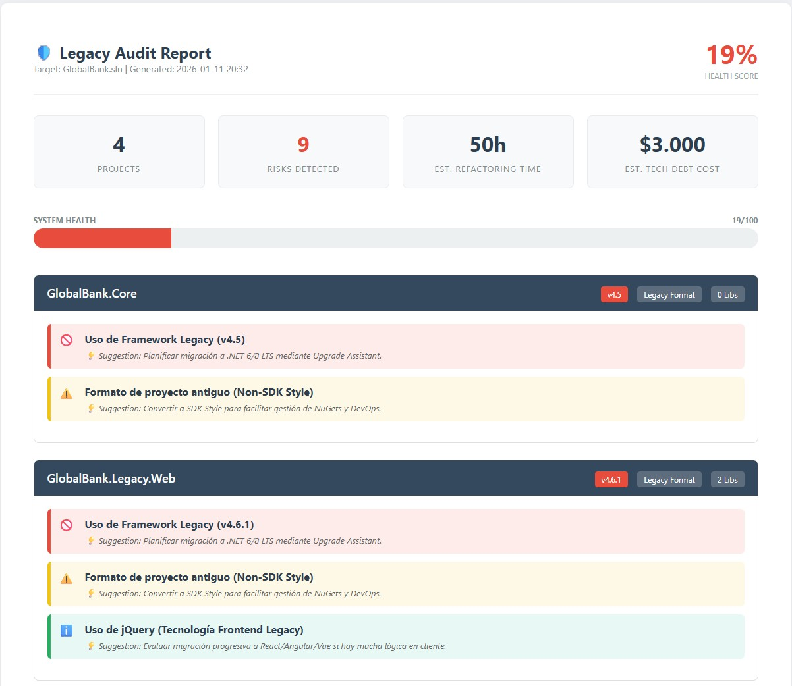
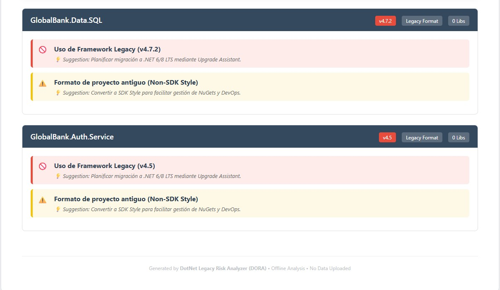

# 🛡️ DotNet Legacy Risk Analyzer (DORA)

> **Automated Technical Debt & Risk Assessment for .NET Portfolios.**
> *Offline-first. Non-intrusive. Enterprise Ready.*

<p align="center">
  
  <br>
  
</p>

## 📋 Overview
**DORA** is a specialized static analysis tool designed to audit legacy .NET solutions (Framework 4.5 - 4.8). It scans source code without execution, identifying architectural risks, obsolescence, and security vulnerabilities related to dependencies.

Designed for high-compliance environments (Banking/Insurance) where code privacy and offline operation are mandatory.

## 🚀 Key Features
- **🛡️ 100% Non-Intrusive:** Uses purely static analysis (reads `.sln` and `.csproj` XML). Zero code execution.
- **🔒 Offline & Secure:** No internet connection required. No data leaves the local environment.
- **📦 Deep Dependency Scan:** Detects NuGet packages hidden in legacy `packages.config` and modern `csproj`.
- **🚦 Severity Scoring:** Automatically categorizes findings into High/Medium/Low risk.
- **💰 Tech Debt Calculator:** Estimates refactoring costs and time based on risk severity.
- **📄 Audit-Ready Reports:** Generates a self-contained, professional HTML report.

## 🏗️ Architecture
The solution follows **Clean Architecture** principles to ensure maintainability and separation of concerns:

| Layer | Responsibility | Dependencies |
|-------|----------------|--------------|
| **Core** | Domain entities (Risk, Project) and Interfaces. | None (Pure C#) |
| **Infrastructure** | File system access, MSBuild integration, XML parsing. | Core, Microsoft.Build |
| **Engine** | Business logic, Risk Rules, Report Generation. | Core, Infrastructure |
| **CLI** | Console entry point and user interaction. | Engine, Infrastructure |

## 🛠️ Technology Stack
- **Target Runtime:** .NET 8 / .NET 9 (Cross-platform)
- **Analysis Target:** .NET Framework 4.0 - 4.8, .NET Core, .NET 5+
- **Key Libraries:** `Microsoft.Build.Locator`, `System.Xml.Linq`

## 💻 Usage

### Prerequisites
- .NET SDK 8.0 or 9.0 installed.
- No Visual Studio installation required (uses Standalone MSBuild).

### Running the Analyzer
```bash
# 1. Clone the repository
git clone [https://github.com/your-username/DotNet-Legacy-Risk-Analyzer.git](https://github.com/your-username/DotNet-Legacy-Risk-Analyzer.git)

# 2. Configure target (Optional)
# Edit src/Dna.Cli/appsettings.json or pass path as argument

# 3. Run directly from CLI
dotnet run --project src/Dna.Cli/Dna.Cli.csproj -- "C:\Path\To\Your\LegacySolution.sln"